# Lab 1: HTTP File Server & Client

## 1. Source Directory Structure

The project contains the server and client implementations with the content to be served.

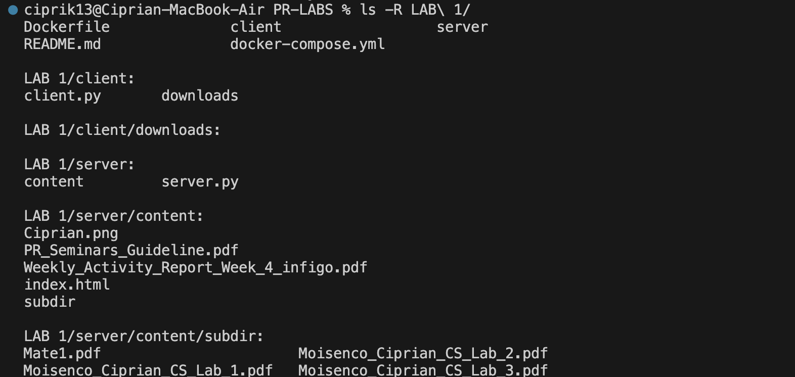

## 2. Docker Configuration Files

### docker-compose.yml

```yaml
services:
  server:
    build:
      context: .
      dockerfile: Dockerfile
    ports:
      - "8080:8080"
```

### Dockerfile

```dockerfile
FROM python:3.11-slim
WORKDIR /app
COPY server/server.py .
COPY server/content/ ./content/
EXPOSE 8080
CMD ["python", "server.py", "./content"]
```

## 3. Starting the Container

Running the server using Docker Compose with making sure you are in the right directory `cd LAB1` and `docker-compose up --build`:

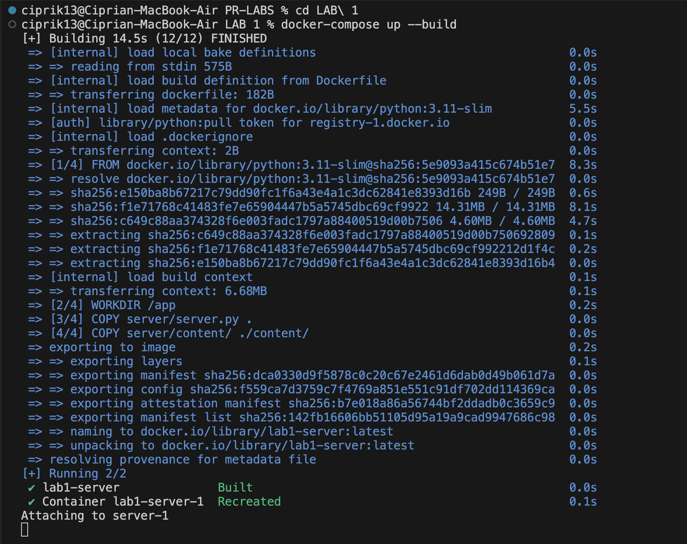

## 4. Server Running Inside Container

After running the server, we can access it through a web browser at http://localhost:8080/. The browser sends HTTP
requests to the server, which responds with the requested files.

The server is started inside the container and listens on port 8080, serving files from the `server/content` directory.

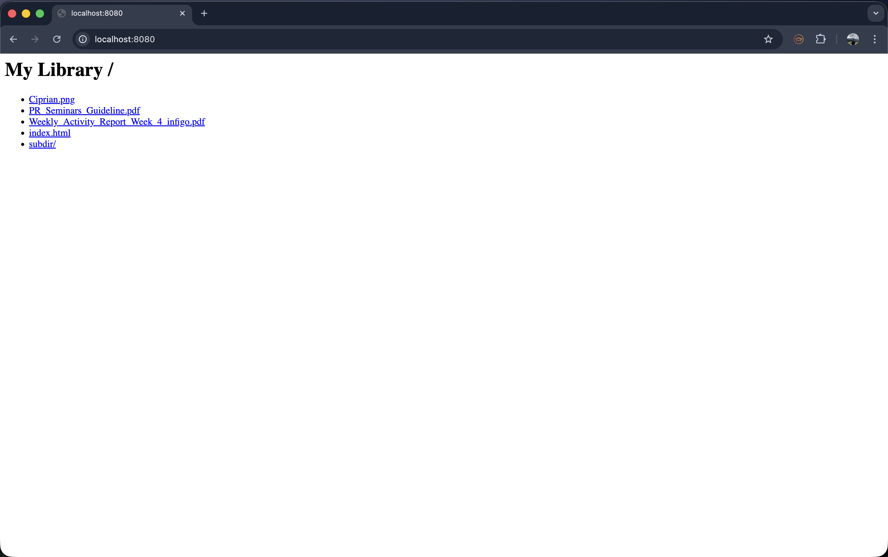

## 5. Contents of the Served Directory

The served directory contains HTML, PNG, and PDF files, as well as subdirectories.


## 6. Browser Requests

### 6.1. Request for Non-Existent File (404)

Requesting a file that doesn't exist returns a 404 Not Found error.

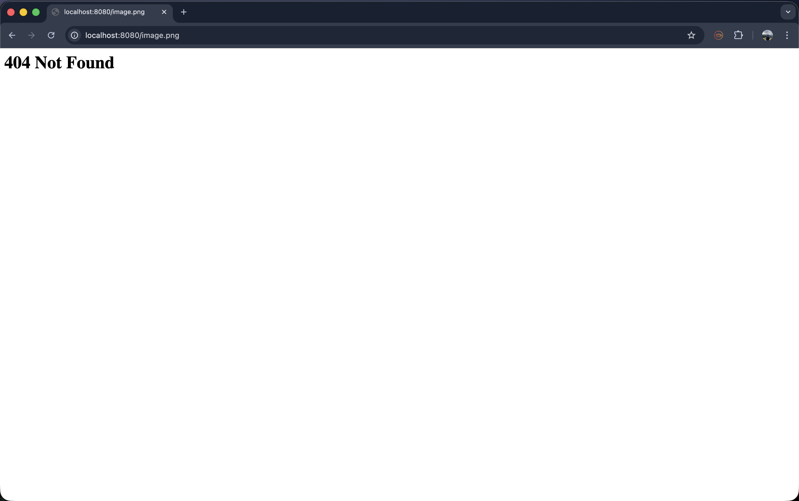

### 6.2. Request for HTML File with Embedded Image

The server successfully serves the HTML file `index.html` which displays embedded content.

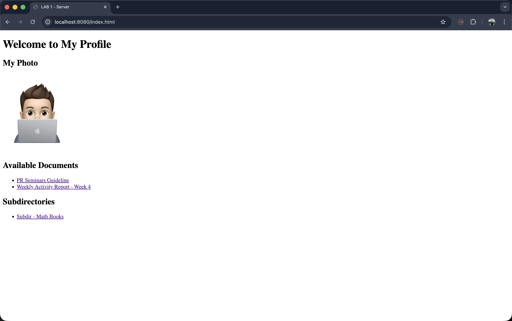

### 6.3. Request for PDF File

Requesting a PDF file `Weekly_Activity_Report_Week_4_infigo.pdf` - the browser opens or downloads it.

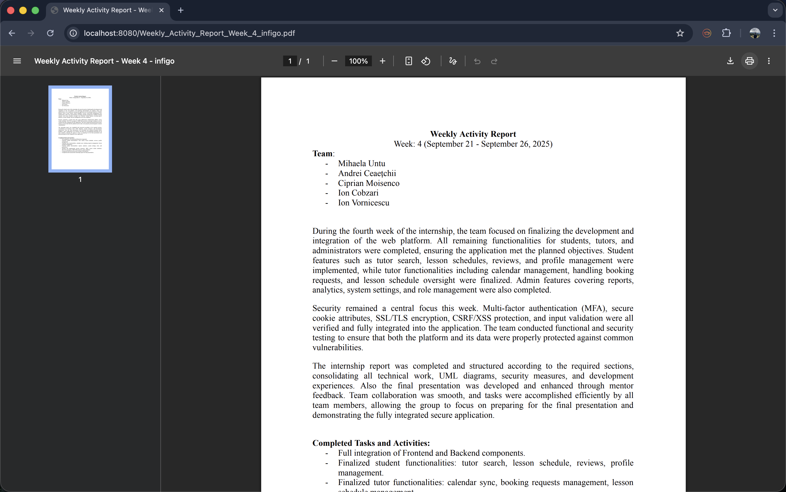

### 6.4. Request for PNG File

Requesting an image file `image.png` - the browser displays the image.

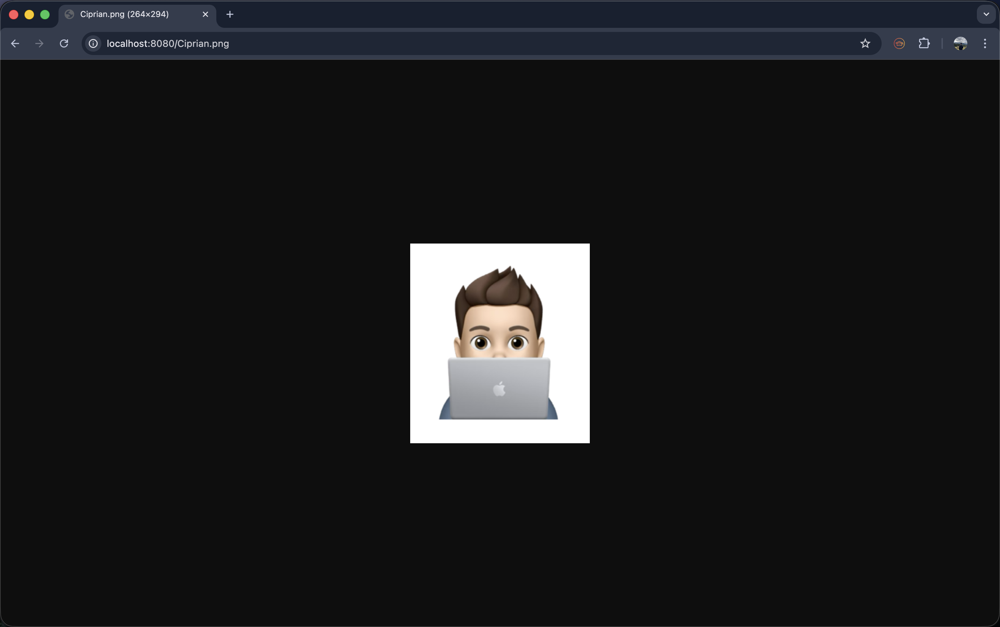

## 7. Client Implementation

### Running the Client

The client can request files from the server being in the right directory `cd LAB\ 1/client` using the command:

```shell
python3 client.py <server_host> <server_port> <filename>
```

### Client Output - HTML File

Requesting an HTML file prints its content to the terminal:

```shell
python3 client.py localhost 8080 /index.html ./downloads

<!DOCTYPE html>
<html lang="en">
    <head>
        <meta charset="UTF-8">
        <meta name="viewport" content="width=device-width, initial-scale=1.0">
        <title>LAB 1 - Server</title>
    </head>
    <body>
        <h1>Welcome to My Profile</h1>

        <h2>My Photo</h2>
        

        <h2>Available Documents</h2>
        <ul>
            <li><a href="PR_Seminars_Guideline.pdf">PR Seminars Guideline</a></li>
            <li><a href="Weekly Activity Report_Week_4_infigo.pdf">Weekly Activity Report - Week 4</a></li>
        </ul>

        <h2>Subdirectories</h2>
        <ul>
            <li><a href="subdir/">Subdir - Math Books</a></li>
        </ul>
    </body>
</html>
```

### Client Output - Image and PDF Files

Requesting binary files saves them to the `downloads/` directory:

```shell
python3 client.py localhost 8080 /Ciprian.png ./downloads
File saved: ./downloads/Ciprian.png (48939 bytes)

python3 client.py localhost 8080 /PR_Seminars_Guideline.pdf ./downloads
File saved: ./downloads/PR_Seminars_Guideline.pdf (106982 bytes)

python3 client.py localhost 8080 /Weekly_Activity_Report_Week_4_infigo.pdf ./downloads
File saved: ./downloads/Weekly_Activity_Report_Week_4_infigo.pdf (62990 bytes)
```

### Saved Files in Downloads Directory

The client successfully downloads and saves files locally:

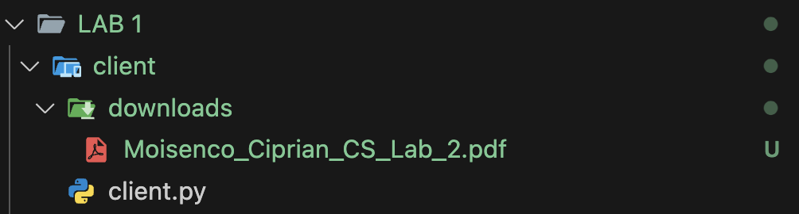

### Client Request for Nested Directory Files

The client can request files from subdirectories:

```shell
python3 client.py localhost 8080 /subdir/ ./downloads
<html><body><h1>My Library /subdir/</h1><ul>
<li><a href='..'>../</a></li>
<li><a href='Moisenco_Ciprian_CS_Lab_2.pdf'>Moisenco_Ciprian_CS_Lab_2.pdf</a></li>
<li><a href='Moisenco_Ciprian_CS_Lab_3.pdf'>Moisenco_Ciprian_CS_Lab_3.pdf</a></li>
<li><a href='images'>images/</a></li>
</ul></body></html>

python3 client.py localhost 8080 /subdir/Moisenco_Ciprian_CS_Lab_2.pdf ./downloads
File saved: ./downloads/Moisenco_Ciprian_CS_Lab_2.pdf (154928 bytes)

python3 client.py localhost 8080 /subdir/Moisenco_Ciprian_CS_Lab_3.pdf ./downloads
File saved: ./downloads/Moisenco_Ciprian_CS_Lab_3.pdf (202343 bytes)
```

In Terminal:
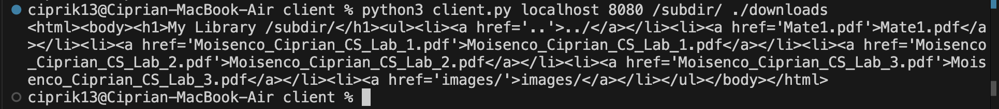
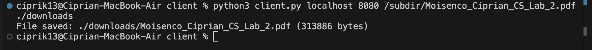

### Client Handling 404 Errors

When requesting a non-existent file, the client receives a 404 response:

```shell
python3 client.py localhost 8080 /nonexistent.html ./downloads
<h1>404 Not Found</h1>
```

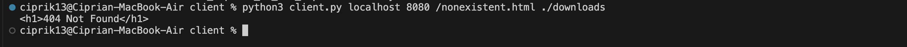

## 8. Directory Listing Feature

When accessing a directory URL (e.g., `/subdir/`), the server generates an HTML page listing all files in that directory.
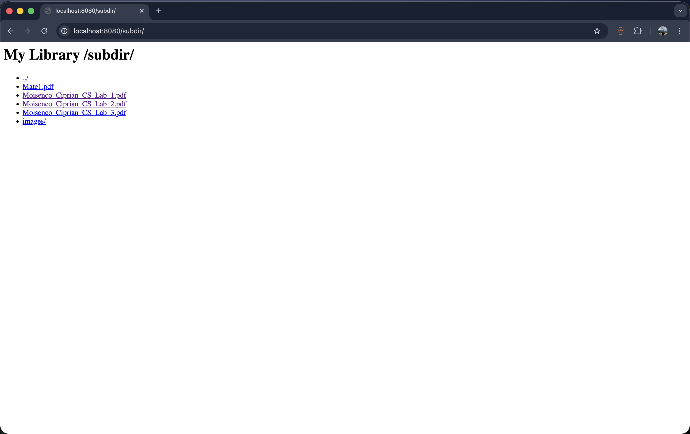

## 9. Browsing Friend's Server (Optional)
### Network Setup
My computer and my friend’s were connected to the same LAN, enabling direct interaction via their local IPs on port 8080. This setup used only TCP sockets and did not rely on VPNs or any internet-based tunneling.

### Finding IP Address of my friend
Using Windows’ ipconfig command, my friend found their local IP address and provided it to me.


### My IP Address
I verified my own IP using ifconfig (on macOS/Linux).


### Contents of Friend's Server
The friend’s server hosted the following files:


### Requests to Friend's Server Using Your Client
I used my own HTTP client to connect and download files from my friend’s server.
All files were successfully retrieved and saved into the local downloads/ directory.

```py
ciprik13@Ciprian-MacBook-Air client % python3 client.py 192.168.1.214  8080 image.png downloads
File saved: downloads/image.png (645888 bytes)
ciprik13@Ciprian-MacBook-Air client % python3 client.py 192.168.1.214  8080 doc.pdf downloads 
File saved: downloads/doc.pdf (524526 bytes)
ciprik13@Ciprian-MacBook-Air client %
```


## Conclusion
This laboratory work successfully demonstrated the implementation of a complete HTTP file server and client system using raw TCP sockets in Python. The server was containerized using Docker, enabling efficient deployment and isolation, while supporting essential HTTP features including file serving, directory listing, and proper error handling with status codes. The client implementation successfully demonstrated the ability to download various file types (HTML, PDF, PNG) and handle both local and remote servers. The practical aspect of connecting to a friend's server over LAN reinforced understanding of network communication principles and the HTTP protocol. This hands-on experience provided valuable insights into client-server architecture, socket programming, and the fundamentals of web communication protocols.

## References
1. [Python Socket Programming Documentation](https://docs.python.org/3/howto/sockets.html)
2. [Docker 101 Tutorial](https://www.docker.com/101-tutorial/)
3. [Sockets & Networking](https://web.mit.edu/6.031/www/fa20/classes/24-sockets-networking/)
