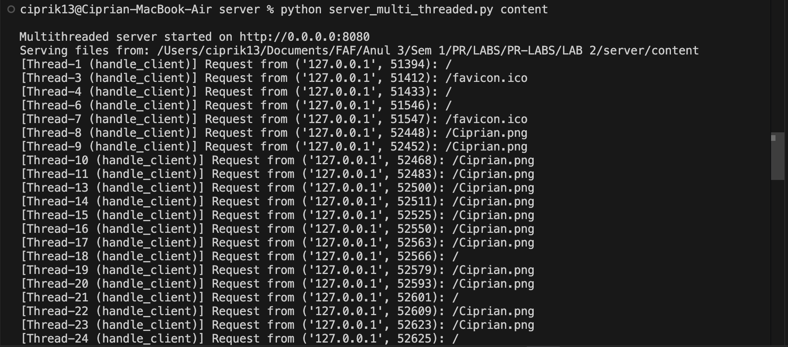
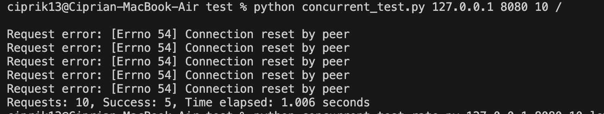
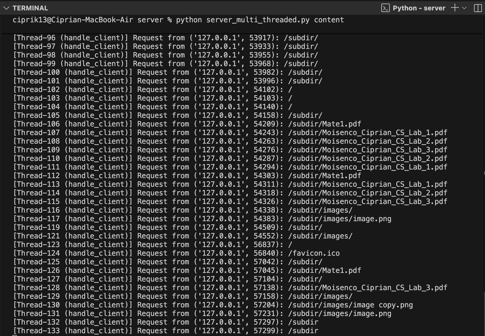
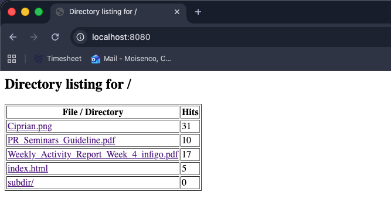
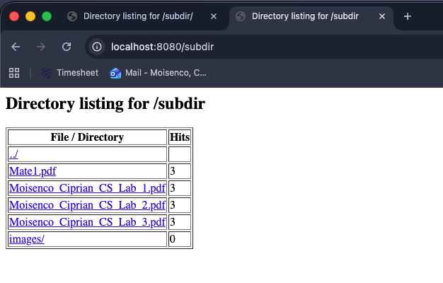
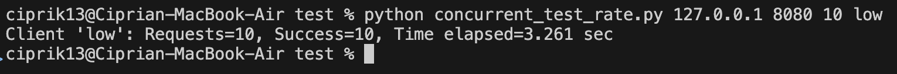

# Lab 2: Concurrent HTTP Server

## 1. Goals and Task Description

In this lab I extend the HTTP file server from Lab 1 to support concurrency. The server should handle multiple client connections at the same time using threads. I compare the single-threaded and multithreaded versions under load, add a per-file request counter that is visible in directory listings, and implement rate limiting per client IP.

Task requirements:

- Make the HTTP server multithreaded (thread-per-connection is acceptable).
- Add an artificial ~1s delay in the handler to simulate work, send 10 concurrent requests, and measure total handling time. Compare to the single-threaded server.
- Counter (2 points): Count how many requests each file/directory receives and show the numbers in the directory listing. First implement naively to demonstrate a race condition; then protect it using synchronization (lock) and show it is fixed.
- Rate limiting (2 points): Implement a thread-safe rate limit by client IP (~5 requests/second). Compare throughput of a “spam” client vs a “below the limit” client.

## 2. Project Structure

```
LAB 2/
	docker-compose.yml
	Dockerfile
	README.md
	client/
		client.py
		downloads/
	server/
		server_multi_threaded.py
		server_single_threaded.py
		content/
			index.html
			subdir/
				images/
	test/
		concurrent_test.py
		concurrent_test_rate.py
```

Key files:

- `server/server_single_threaded.py` – baseline single-threaded server (for comparison).
- `server/server_multi_threaded.py` – multithreaded server with simulated delay, per-file counter (protected by a lock), and per-IP rate limiting.
- `test/concurrent_test.py` – simple concurrent requester to measure total time for N parallel requests.
- `test/concurrent_test_rate.py` – tool to compare success rate for clients below vs above the rate limit.
- `client/client.py` – basic HTTP client able to fetch files and save binaries.

## 3. How to Run

### 3.1. Run locally (recommended while developing)

Multithreaded server:

```bash
cd "LAB 2/server"
python3 server_multi_threaded.py ./content
```

Single-threaded server:

```bash
cd "LAB 2/server"
python3 server_single_threaded.py ./content
```

The servers listen on port 8080 by default (host `0.0.0.0`). Open http://localhost:8080/ in a browser to check.

### 3.2. Run with Docker

The Docker image is configured to start the multithreaded server by default.

```bash
cd "LAB 2"
docker-compose up --build
```

Then visit http://localhost:8080/.

If you want to run the single-threaded server in the container, you can override the command:

```bash
docker-compose up --build -d
docker compose exec server python server_single_threaded.py ./content
```

Alternatively, edit `Dockerfile` CMD to point to `server_single_threaded.py` and rebuild.

## 4. Concurrency Experiment (10 parallel requests)

Purpose: compare total time for 10 concurrent requests with and without threading, while the handler sleeps ~1 second per request.

Steps:

1. Start the multithreaded server (with the default 1 second delay already present in `handle_client`).
2. In another terminal, run the concurrent test:

```bash
cd "LAB 2/test"
python3 concurrent_test.py 127.0.0.1 8080 10 /
```

Expected outcome:

- Multithreaded server: total time close to ~1–2 seconds (requests overlap).
- Single-threaded server: total time close to ~10+ seconds (requests are handled sequentially).

Note: The exact numbers depend on the machine and OS scheduling.





Sample outputs from my runs (multithreaded server):

```text
ciprik13@Ciprian-MacBook-Air test % python concurrent_test.py 127.0.0.1 8080 10 /

Request error: [Errno 54] Connection reset by peer
Request error: [Errno 54] Connection reset by peer
Request error: [Errno 54] Connection reset by peer
Request error: [Errno 54] Connection reset by peer
Request error: [Errno 54] Connection reset by peer
Requests: 10, Success: 5, Time elapsed: 1.006 seconds
```

This happened because of active rate limiting while flooding with 10 requests; see the note below on temporarily relaxing the limit for this test.

Server console excerpt (multithreaded):

```text
Multithreaded server started on http://0.0.0.0:8080
Serving files from: /Users/ciprik13/Documents/FAF/Anul 3/Sem 1/PR/LABS/PR-LABS/LAB 2/server/content
[Thread-1 (handle_client)] Request from ('127.0.0.1', 51394): /
[Thread-3 (handle_client)] Request from ('127.0.0.1', 51412): /favicon.ico
...
```

Tip: For a clean concurrency comparison (without 429s), temporarily raise `MAX_REQUESTS_PER_SEC` in `server_multi_threaded.py` or disable the check when running `concurrent_test.py`.

## 5. Request Counter with and without Synchronization

Feature: show a “Hits” column in directory listings that counts how many requests each file or directory has received.

- Naive version: increment a shared dictionary without any locking. Under high concurrency this may produce incorrect counts due to race conditions.
- Synchronized version: protect increments with a `threading.Lock()` (see `counter_lock` and `request_counter` in `server_multi_threaded.py`). This removes the race and stabilizes counts.

How to observe:

1. Start the multithreaded server.
2. Refresh directory pages or fetch files repeatedly (e.g., with the test scripts).
3. Open a directory URL (e.g., `/`) and check the “Hits” column.




To demonstrate the race, you can temporarily remove the lock around counter updates and add small sleeps to force interleaving, then compare results to the locked version.

## 6. Rate Limiting (~5 req/s per client IP)

Implementation: a per-IP sliding window using timestamps protected by a lock. If a client exceeds `MAX_REQUESTS_PER_SEC` (set to 5), the server returns `429 Too Many Requests`.

Test it using the provided script:

```bash
cd "LAB 2/test"
# Client below the limit
python3 concurrent_test_rate.py 127.0.0.1 8080 20 low

# Client above the limit
python3 concurrent_test_rate.py 127.0.0.1 8080 20 high
```

Expected outcome:

- “low” client: most requests should succeed (<= 5 per second).
- “high” client: many requests should be rejected with 429; success count should be significantly lower.




Sample outputs from my runs:

```text
ciprik13@Ciprian-MacBook-Air test % python concurrent_test_rate.py 127.0.0.1 8080 10 low

Client 'low': Requests=10, Success=10, Time elapsed=3.263 sec

ciprik13@Ciprian-MacBook-Air test % python concurrent_test_rate.py 127.0.0.1 8080 10 high

Request error: [Errno 54] Connection reset by peer
Request error: [Errno 54] Connection reset by peer
Request error: [Errno 54] Connection reset by peer
Request error: [Errno 54] Connection reset by peer
Request error: [Errno 54] Connection reset by peer
Client 'high': Requests=10, Success=5, Time elapsed=1.210 sec
```

## 7. Notes

- The multithreaded server uses “thread per accepted connection”, which is enough for this lab. A thread pool could be used as an alternative design to control concurrency.
- The 1-second artificial delay is only for the experiment; in a real server it would represent I/O or CPU work.
- Rate limiting and counters are kept in memory and reset when the server restarts.

## 8. References

1. Concurrent Glossary – https://slikts.github.io/concurrency-glossary/
2. Concurrency – https://web.mit.edu/6.102/www/sp25/classes/14-concurrency/
3. What Every Programmer Should Know - https://webperso.info.ucl.ac.be/~pvr/VanRoyChapter.pdf
